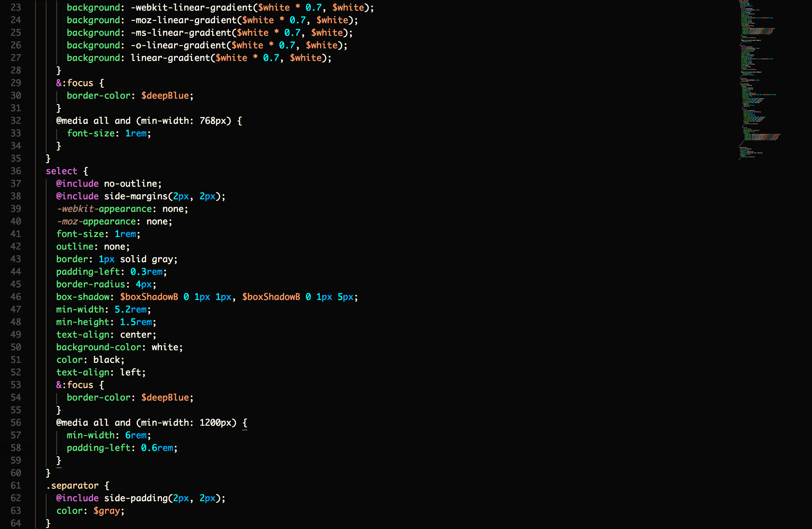
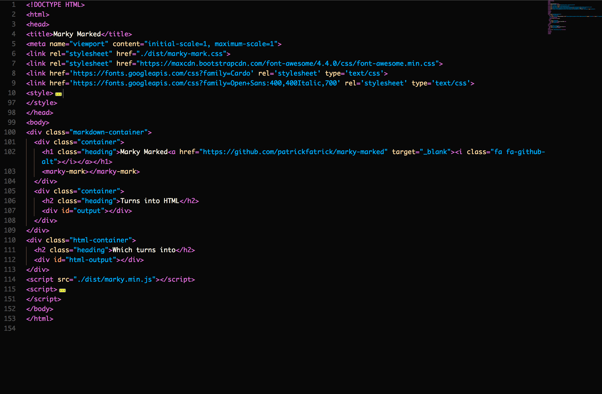
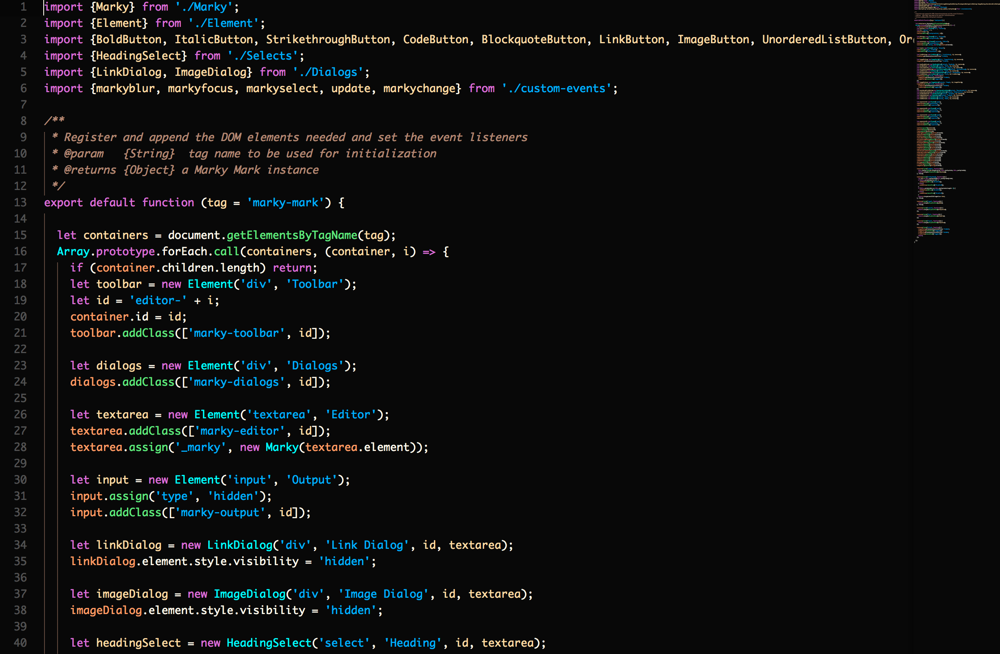

The Orchid Color Scheme for Sublime
=========

Based on the original theme made for Brackets, found [here](https://github.com/patrickfatrick/orchid-theme).

This color scheme is intended to be pleasant but still easy to read. It's mostly designed to be used in HTML, CSS/SCSS, and ES6 Javascript (using [JavascriptNext](https://github.com/Benvie/JavaScriptNext.tmLanguage)).

The font used in the screenshots is Monaco, in case you're curious.

To install, 

```bash
$git clone git@github.com:patrickfatrick/orchid-theme-sublime.git
```
Move the file into your Application Support/Sublime Text/Packages/User folder, restart the editor and select the color scheme.

Or use Package Control and search for "orchid-theme-sublime".

## Theme Colors


`#FF9A69` `#B28773` `#262626` `#FFDAA5` `#E84D49` `#DA70D6` `#63E87F` `#FFFAED` `#00B0FF` `#00FFFF`

## CSS/SCSS 



## HTML



## JavaScript (with JavascriptNext)



## Markdown (with Markdown Extended)

