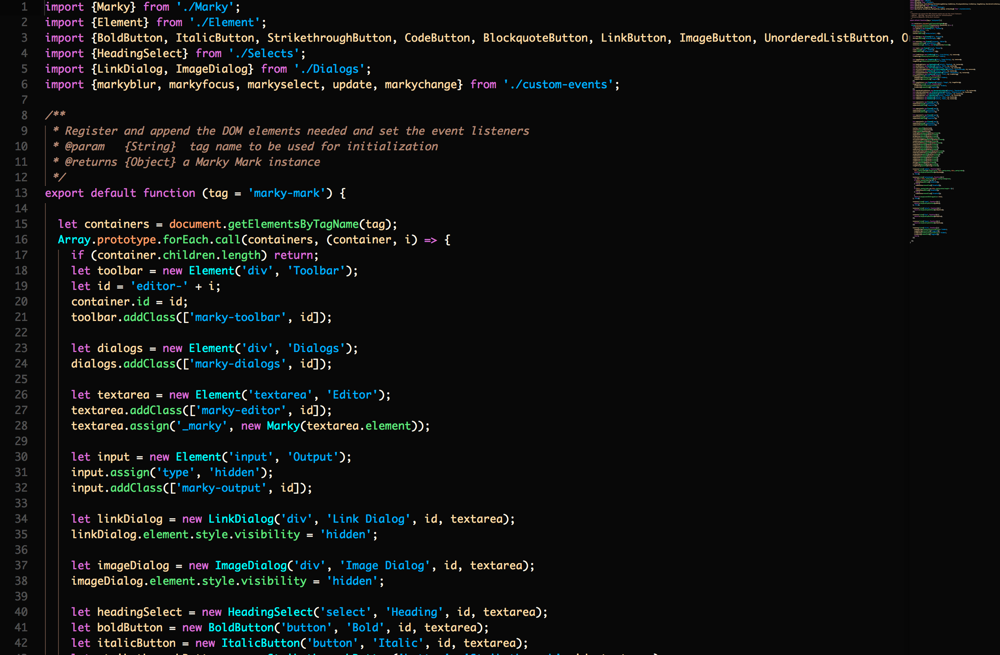

# Cattleya (kăt′lē-ə) Color Scheme for Sublime Text

**Cattleya** (formerly orchid) is a color scheme for [Sublime Text](https://sublimetext.com) that aims to be one you can look at all day. It's contrasty, it's fun, it uses syntax grammars to their fullest (mostly JS and TS since that's what I spend the most time looking at). Note: I'm new Nova and this extension is still a work-in-progress.

## Installation

```bash
$git clone git@github.com:patrickfatrick/cattleya-theme-sublime.git
```

Move the file into your Application Support/Sublime Text/Packages/User folder, restart the editor and select the color scheme.

Or use Package Control and search for "cattleya-theme-sublime".

### Theme Colors


`#FF9A69` `#B28773` `#262626` `#FFDAA5` `#E84D49` `#DA70D6` `#63E87F` `#FFFAED` `#00B0FF` `#00FFFF`

### CSS/SCSS 


### HTML


### JavaScript (with JavascriptNext)



### Markdown (with Markdown Extended)


### BracketHighlighter

I've also included styles that can be used to override [BracketHighlighter's](https://github.com/facelessuser/BracketHighlighter) defaults for bracket matching. In your bh_core.sublime-settings file you'll want to specify the bracket styles pointing to the brackethighlighter.orchid and the brackethighlighter.orchidUnmatched scopes, like so:

```json
"default": {
	"icon": "dot",
	"color": "brackethighlighter.orchid",
	"style": "solid"
},
"unmatched": {
	"icon": "question",
	"color": "brackethighlighter.orchidUnmatched",
	"style": "solid"
}
```

The final result will look something like this (assuming you set all of the bracket options to point to the brackethighlighter.orchid scope).


#### What's in a name?

Years ago I created a theme for Adobe's Brackets editor called "orchid". The name was inspired by a gorgeous purple color used prominently within the theme (#DA70D6, aka ["orchid"](https://en.wikipedia.org/wiki/Orchid_(color))). Since then, as I've moved to other code editors, I've adapted and improved on this theme for whichever editor I'm using at any given moment. I hadn't really given the name much thought since I originally created it. As I'm now working on bringing this theme to nova I'm now considering the name again, and I've landed on "cattleya" because it's an evocative name which harkens back to the original, cattleya being a genus within the orchid family.


